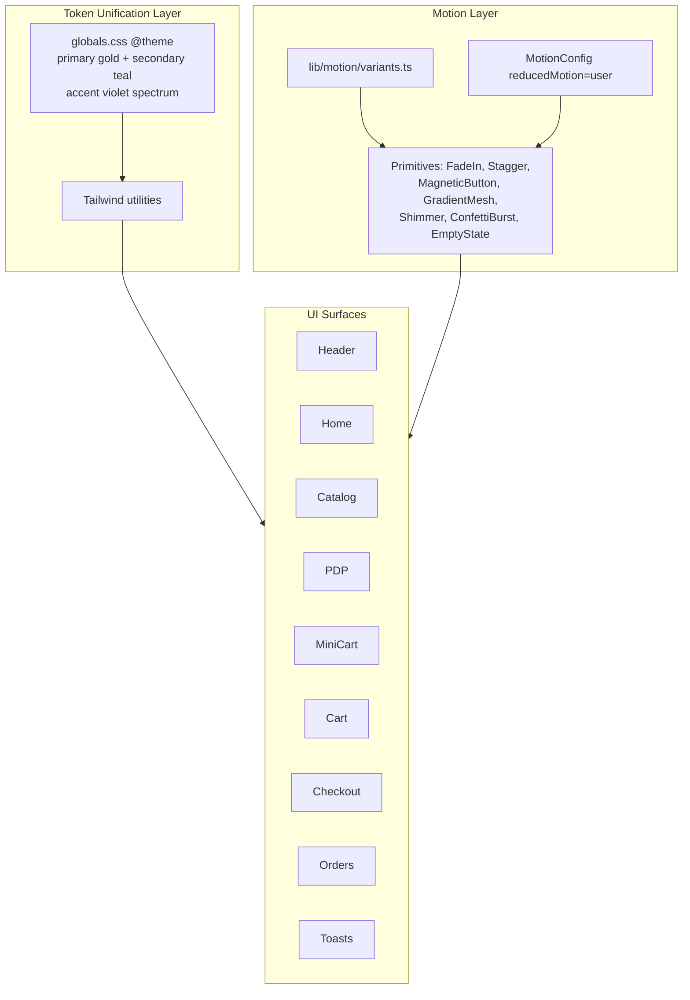
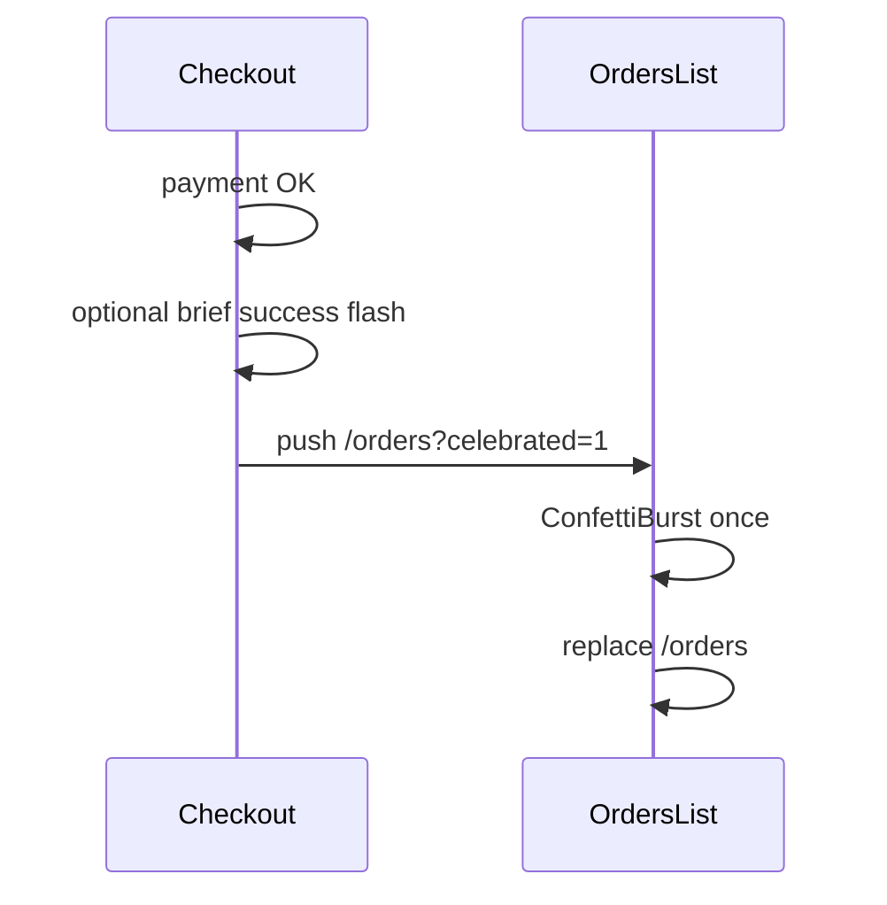
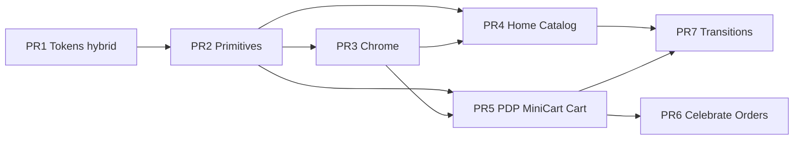

# Veloce Frontend UI/UX Improvements — Colorful Visual Animation Experience

| Field | Value |
|-------|-------|
| **Author** | TBD |
| **Date** | 2026-07-23 |
| **Status** | Revised (addresses design review) |
| **Scope** | Frontend only (`frontend/`) — Next.js 16 App Router, React 19, Tailwind CSS v4, Framer Motion 12 |
| **Canonical project root** | `C:\Users\Faizan J\OneDrive\Desktop\BITS\ecommerce` |
| **Related docs** | `docs/07-frontend-design.md`, `ARCHITECTURE_SPECIFICATION.md` (under `BITS\ecommerce`) |

---

## Overview

Veloce is a dark glassmorphic ecommerce storefront with Outfit typography and sparse Framer Motion (home hero, MiniCart, skeleton pulses). The live codebase currently runs a **split brand system**: gold/teal design tokens in `@theme` (home + ProductCard) versus violet/fuchsia gradients (Header, MiniCart, checkout, Razorpay theme). Motion is inconsistent, toasts are static, and success moments lack delight.

This design elevates interaction so the storefront feels **premium, energetic, and memorable** without becoming cartoonish. It defines:

1. A **unified hybrid color + motion system** (token unification first, not a third palette)
2. **Page-by-page** interaction upgrades across the shopping journey
3. **Reusable Framer Motion 12 primitives** with concrete composition contracts
4. **Performance & accessibility** guardrails
5. An incremental **PR Plan** with concrete files and merge order

No backend redesign is proposed. UI contract / env quirks are noted as out-of-scope.

---

## Background & Motivation

### Current state (as implemented)

Verified against `BITS\ecommerce\frontend`:

| Area | Location | Reality |
|------|----------|---------|
| Design tokens | `src/app/globals.css` | **Already has** Tailwind v4 `@theme`: `--color-bg-base: #0F1115`, `--color-surface: #1A1D24`, **`--color-primary: #E2C044` (gold)**, **`--color-secondary: #587B7F` (teal)**, text/border tokens. Body uses these vars. |
| Brand split | Multiple pages | Home + ProductCard use gold token utilities (`bg-primary`, `text-primary`). Header logo/CTAs, MiniCart, cart, checkout, wishlist still use **slate + violet/fuchsia** (`from-violet-500 to-fuchsia-500`). Razorpay theme color is `#8B5CF6`. |
| Root layout | `src/app/layout.tsx` | Outfit + Clerk. No `MotionConfig`. |
| Home | `src/app/page.tsx` | Hero Framer Motion; categories/featured mostly static. |
| Product cards | `src/components/ProductCard.tsx` | Root is plain `<Link>` (not motion-ready for Stagger). CSS hover scale. |
| MiniCart | `src/components/MiniCart.tsx` | Best motion surface (spring drawer + layout). Item `exit` props exist but **list lacks `AnimatePresence`**, so exits never run. |
| Skeletons | `src/components/skeletons/*` | Opacity pulse via Framer Motion (no CSS shimmer). |
| Toasts | `src/context/ToastContext.tsx` | Instant mount/unmount; solid colors; no enter/exit. |
| Header search | `src/components/Header.tsx` | Dropdown without `AnimatePresence`; badge counts static. |
| Checkout success | `src/app/checkout/page.tsx` | On success: `router.push('/orders')` for COD and card. **No success page, no `/orders/[id]` redirect.** |
| Framer Motion adoption | `src/` | ~3 surface families: home hero, MiniCart, skeletons. |

### Pain points

1. **Dual brand** — Gold tokens vs violet gradients confuse implementers and users.
2. **Inconsistent energy** — Hero promises motion; browse/checkout feel flat.
3. **No shared primitives** — Ad-hoc hover classes; no stagger language.
4. **Underused Framer Motion** — Dependency already paid for.
5. **Toasts utilitarian** — Miss add-to-cart / order success delight.
6. **Empty states text-only**.
7. **A11y gap** — No `prefers-reduced-motion` handling.

### Brand positioning

- Premium dark ecommerce; streetwear/anime-apparel energy OK if tasteful.
- **Canonical hybrid brand** (see Key Decision #0 below): gold primary CTAs + teal secondary + violet spectrum accents.
- Currency: INR via `formatCurrency`.
- Product photography is the hero on catalog/PDP.

---

## Goals & Non-Goals

### Goals

1. Unify color tokens so motion/glow work against one system.
2. Page-by-page interaction improvements across the storefront journey.
3. Reusable animation primitives with **implementable composition contracts**.
4. Performance & a11y: reduced motion, transform/opacity-only, LCP/CLS/INP budgets.
5. Frontend-only; Framer Motion only (no GSAP/Lottie/Rive).
6. Implementable PR Plan with concrete files.

### Non-Goals

- Backend API redesign or schema changes.
- Fixing API base URL (`localhost:5000` vs FastAPI `8000`) — note only.
- Full Clerk redesign beyond `appearance` hooks.
- Light mode expansion.
- Admin dashboard overhaul (inherit tokens only).
- New animation libraries.
- Pricing policy changes (free-shipping threshold).

### Out-of-scope notes

| Note | Severity | Why out of scope |
|------|----------|------------------|
| `api.ts` default port 5000 vs FastAPI 8000 | Medium | Env config |
| Order field naming (`status` vs `orderStatus`) | Medium | API/client contract |
| Free-shipping threshold `subtotal >= 100` / ₹10 | Low | Product policy — **do not visualize as progress bar until confirmed** |
| Home empty CTA `/login` vs Clerk `/sign-in` | Low | Bugfix (fix if touched in PR4) |

---

## Proposed Design

### Architecture overview



### 0. Brand unification — Hybrid “Veloce Spectrum” (resolves dual palette)

**Canonical decision:** **Hybrid brand**

| Role | Token | Value | Usage |
|------|-------|-------|-------|
| Background | `--color-bg-base` | `#0F1115` | Page bg (existing) |
| Surface | `--color-surface` | `#1A1D24` | Cards (existing) |
| Border | `--color-border` | `#2A2F3A` | Borders (existing) |
| Text main/muted | existing | existing | Typography |
| **Primary CTA** | `--color-primary` | `#E2C044` gold | Buttons: Shop, Checkout, Place order, Add to cart default |
| **Secondary** | `--color-secondary` | `#587B7F` teal | Links, chips, secondary buttons |
| **Accent from** | `--color-accent-from` | `#8b5cf6` violet | Logo energy, mesh orbs, badge glows |
| **Accent via** | `--color-accent-via` | `#d946ef` fuchsia | Gradient mid (logo, mesh only) |
| **Accent to** | `--color-accent-to` | `#ec4899` pink | Gradient end |
| Success | `--color-success` | `#10b981` | Toasts, added states |
| Danger / wishlist | `--color-danger` | `#f43f5e` | Errors, heart active |
| Glow primary | `--color-glow-primary` | gold @ 25% | CTA focus ring |
| Glow accent | `--color-glow-accent` | violet @ 25% | Mesh / logo hover |

**Migration rules for PR1:**

1. **Do not invent a third greenfield `--velo-*` set that replaces `@theme`.** Extend existing `@theme` with accent/success/danger/glow vars.
2. **Primary CTAs → gold** (`bg-primary text-bg-base` or equivalent), migrating Header/MiniCart/checkout off `from-violet-500 to-fuchsia-500` fills.
3. **Logo wordmark** may keep multi-stop **accent gradient text** (violet→fuchsia→pink) for brand energy.
4. **GradientMesh** uses accent orbs at low opacity on marketing surfaces only (home, auth frames).
5. **Razorpay theme color** → gold primary hex `#E2C044` (or secondary teal if gold fails contrast in Razorpay UI — document fallback `#587B7F`).
6. Home/ProductCard already on gold — keep; polish motion only.

**Restraint:** At most **one** ambient mesh + **one** primary (gold) CTA dominant in view. Product photography remains the catalog/PDP hero.

#### Glass elevation scale (palette-agnostic)

| Level | Pattern |
|-------|---------|
| L0 Base | `bg-bg-base` |
| L1 Surface | `bg-surface/80 border border-border backdrop-blur-sm` |
| L2 Elevated | `bg-surface border-border backdrop-blur-md shadow-xl` |
| L3 Overlay | `bg-bg-base/60 backdrop-blur-sm` |
| L4 Drawer | `bg-bg-base border-l border-border shadow-2xl` |

### 1. Motion system — “Veloce Kinetic”

#### Timing scale

| Token | Duration | Easing | Use |
|-------|----------|--------|-----|
| `instant` | 100ms | easeOut | Press opacity |
| `fast` | 180ms | easeOut | Hover, badge pop |
| `base` | 280ms | `[0.22, 1, 0.36, 1]` | Fade-in sections |
| `enter` | 400ms | spring 260/24 | Drawers, dropdowns |
| `emphasis` | 500–700ms | spring 200/20 | Hero, success |
| `ambient` | 8–16s loop | easeInOut | Mesh drift only |

#### Motion principles

1. Transform + opacity only (except intentional `layout` on cart lines).
2. Stagger = `index * 0.05s`, cap 0.4s total.
3. Enter distance 12–24px (never >40px).
4. One hero motion per viewport.
5. Celebrate outcomes (order success, first wishlist), not navigation.
6. Reduced motion = opacity ≤150ms, no springs/mesh/confetti/magnetic.

#### Shared variants — `lib/motion/variants.ts`

```ts
import type { Transition, Variants } from 'framer-motion';

export const easings = { out: [0.22, 1, 0.36, 1] as const };

export const transitions = {
  fast: { duration: 0.18, ease: easings.out } satisfies Transition,
  base: { duration: 0.28, ease: easings.out } satisfies Transition,
  spring: { type: 'spring', stiffness: 260, damping: 24 } satisfies Transition,
  softSpring: { type: 'spring', stiffness: 200, damping: 22 } satisfies Transition,
};

export const fadeUp: Variants = {
  hidden: { opacity: 0, y: 16 },
  show: { opacity: 1, y: 0, transition: transitions.base },
};

export const fadeIn: Variants = {
  hidden: { opacity: 0 },
  show: { opacity: 1, transition: transitions.fast },
};

export const staggerContainer: Variants = {
  hidden: {},
  show: { transition: { staggerChildren: 0.05, delayChildren: 0.05 } },
};

export const scaleIn: Variants = {
  hidden: { opacity: 0, scale: 0.96 },
  show: { opacity: 1, scale: 1, transition: transitions.spring },
};

export const drawerSlide = {
  hidden: { x: '100%' },
  show: { x: 0, transition: transitions.spring },
  exit: { x: '100%', transition: { duration: 0.22, ease: easings.out } },
};

export const reducedFade: Variants = {
  hidden: { opacity: 0 },
  show: { opacity: 1, transition: { duration: 0.12 } },
};
```

#### Reduced-motion wiring

- Wrap app in `MotionConfig reducedMotion="user"` inside `AppProvider`.
- Prefer Framer’s `useReducedMotion()` under that config for branch logic.
- Custom `usePrefersReducedMotion` only if needed; **SSR default `true` is safer** (no spring flash for reduced-motion users). If default `false`, accept brief first-paint mismatch — document in PR2 checklist.
- CSS: `@media (prefers-reduced-motion: reduce)` freezes shimmer; static icons instead of spin.
- **MagneticButton gate:** `matchMedia('(pointer: fine) and (hover: hover)')` AND not reduced-motion; strength `0` otherwise.

### 2. Reusable animation primitives

Directory: `frontend/src/components/motion/`

| Component | Responsibility |
|-----------|----------------|
| `FadeIn` | Mount / whileInView fade-up |
| `Stagger` / `StaggerItem` | Container + children with `fadeUp` variants |
| `PageTransition` | Soft opacity+y; **flagged off**; App Router pattern below |
| `MagneticButton` | Pointer pull on fine pointers only |
| `GradientMesh` | 2–3 accent orbs, marketing only |
| `Shimmer` | CSS shimmer block |
| `AnimatedBadge` | Cart/wishlist count spring |
| `ConfettiBurst` | ≤40 FM particles; brand gold + accent + emerald |
| `EmptyState` | Branded empty panel |
| `Pressable` | `whileTap={{ scale: 0.97 }}` |

Also: `lib/cn.ts` (**required in PR1** — simple `clsx`-style join or `twMerge` if already available; no new dependency required: `(...a) => a.filter(Boolean).join(' ')` is enough).

#### Composition contracts (critical)

**MagneticButton — no Radix Slot / no `asChild`**

```tsx
type MagneticButtonProps = {
  children: React.ReactNode;
  className?: string;
  strength?: number; // default 8; forced 0 when reduced motion or coarse pointer
  href?: string;     // if set → next/link; else → <button type="button">
  type?: 'button' | 'submit';
  onClick?: React.MouseEventHandler;
  disabled?: boolean;
};
```

Implementation: single component that renders `Link` or `button`, merges className via `cn`, attaches magnetic handlers to the outer element. **Do not** use `asChild`.

**FadeIn**

```tsx
type FadeInProps = {
  children: React.ReactNode;
  className?: string;
  delay?: number;
  y?: number;      // default 16
  once?: boolean;  // default true
};
// Always motion.div wrapper (do not require polymorphic `as` in v1)
```

**Stagger + ProductCard**

- `Stagger` renders `motion.div` with `variants={staggerContainer}` and `initial="hidden" animate="show"`.
- Direct children must be `motion` components with `variants={fadeUp}` (or wrap with `StaggerItem`).
- **ProductCard mandate:** change root from plain `<Link>` to `motion(Link)` (or outer `motion.div` wrapping Link with `variants={fadeUp}` and `className` preserving card layout). Pass through optional `className`.
- Document: Framer stagger only affects **direct** motion children.

**MiniCart list exits**

```tsx
<AnimatePresence initial={false}>
  {items.map((item) => (
    <motion.div key={item.id} layout exit={{ opacity: 0, x: 24 }} …>
      …
    </motion.div>
  ))}
</AnimatePresence>
```

PR5 acceptance: remove line item → exit animation visible.

**PageTransition (PR7 only)**

App Router layouts do **not** remount on client navigations.

**Required pattern (pick one):**

1. **Preferred:** `src/app/template.tsx` client component:

```tsx
'use client';
export default function Template({ children }: { children: React.ReactNode }) {
  // FadeIn / motion.div — template remounts per navigation
  return <PageTransition>{children}</PageTransition>;
}
```

2. **Alternative:** Client shell with `const pathname = usePathname(); <motion.div key={pathname}>…`

- Only animate `{children}` page body. Header/Footer are currently **inside each page**, so root `template.tsx` around `{children}` is structurally correct.
- Focus: move focus to `<main id="main-content" tabIndex={-1}>` after transition when flag on.
- Default `flags.pageTransitions = false`.

#### Skeleton shimmer

```css
@keyframes velo-shimmer {
  0% { background-position: 200% 0; }
  100% { background-position: -200% 0; }
}
.velo-shimmer {
  background: linear-gradient(90deg, …surface…, …border…, …surface…);
  background-size: 200% 100%;
  animation: velo-shimmer 1.4s ease-in-out infinite;
}
@media (prefers-reduced-motion: reduce) {
  .velo-shimmer { animation: none; }
}
```

Remove infinite Framer opacity loops on skeletons.

### 3. Page-by-page interaction improvements

#### 3.1 Home (`app/page.tsx`)

| Element | Improvement |
|---------|-------------|
| Hero bg | `<GradientMesh intensity="medium" />` (accent orbs) |
| Hero CTA | `MagneticButton href="/products"` gold primary |
| Categories | `Stagger` enter; hover lift + border glow |
| Featured grid | Stagger ProductCards |
| Empty | `EmptyState`; CTA `/sign-in` if auth needed (fix `/login` if touched) |

#### 3.2 Header (`components/Header.tsx`)

| Element | Improvement |
|---------|-------------|
| Logo | Accent gradient text (hybrid); hover scale subtle |
| Nav | Underline scaleX on hover/active |
| Search focus | Gold/primary ring; dropdown `AnimatePresence` + stagger rows |
| Badges | `AnimatedBadge` on cart/wishlist counts |
| Sticky | Elevate to L2 after 8px scroll |
| Touch | ≥44px targets |

#### 3.3 Catalog (`app/products/page.tsx`)

Stagger grid on filter/page change; shimmer skeletons; EmptyState + clear filters.

#### 3.4 ProductCard

Motion-compatible root; image hover veil; heart `whileTap`; gold primary add button; success emerald morph.

#### 3.5 PDP

Gallery crossfade; chip springs; qty Pressable; MagneticButton add CTA; structural skeleton.

#### 3.6 MiniCart

Shared springs; **AnimatePresence list**; EmptyState; MagneticButton checkout (`href="/checkout"`); highlight last-added border 600ms (gold/accent).

#### 3.7 Cart page

Stagger/layout lines; L2 summary; MagneticButton checkout; EmptyState.

**Free-shipping progress bar: OUT of PR5.** Optional later only after product confirms INR threshold. Until then do not ship a progress visualization of `subtotal >= 100`.

#### 3.8 Checkout (restrained)

Soft FadeIn sections; selected address ring; payment `layoutId` pill; loading button morph; field shake on error.

**Order success confetti — resolved path B (+ optional A flash):**

Verified current code: always `router.push('/orders')` after COD or Razorpay verify. No success page.

| Step | Behavior |
|------|----------|
| 1 | On successful place/verify, optionally show **in-checkout success banner** 800–1200ms (path A polish; skip delay if reduced-motion). |
| 2 | Navigate: `router.push('/orders?celebrated=1')` (path **B** — required). |
| 3 | `orders/page.tsx`: on mount, if `celebrated=1`, fire `ConfettiBurst` once, then `router.replace('/orders')` to clear query (or `sessionStorage` flag `veloce_celebrate_order` as alternate). |
| 4 | Gate with `flags.confettiSuccess` and reduced-motion (no confetti). |

Do **not** mount confetti only on unmounting checkout without persistence — navigation will kill it.



#### 3.9 Wishlist / Orders

Stagger grids; EmptyState; order list FadeIn; detail stepper progress animation (field-name bugs remain out of scope but stepper should read `orderStatus` when API provides it).

#### 3.10 Toasts

AnimatePresence slide+fade; glass L2; colored border; roles `status`/`alert`; max 3.

#### 3.11 Auth / Footer

Low-intensity mesh frame around Clerk; footer gradient border + link hover. Clerk `appearance` maps primary to gold.

---

## API / Interface Changes

**No backend API changes.**

### New modules

```
frontend/src/
  lib/
    cn.ts                          # required
    featureFlags.ts
    motion/
      variants.ts
      usePrefersReducedMotion.ts   # optional thin wrapper
  components/motion/
    FadeIn.tsx, Stagger.tsx, PageTransition.tsx,
    MagneticButton.tsx, GradientMesh.tsx, Shimmer.tsx,
    AnimatedBadge.tsx, ConfettiBurst.tsx, EmptyState.tsx,
    Pressable.tsx, index.ts
  app/template.tsx                 # PR7 only, when enabling page transitions
```

### Toast API (backward compatible)

```ts
addToast(message: string, type: ToastType, options?: { duration?: number; id?: string }): void;
```

### Cart badge pulse

Prefer `useEffect` on `cart.totalItems` in Header, or `lastAddedAt` on CartContext — no REST change.

### Checkout navigation contract (frontend-only)

```ts
// after successful order
router.push('/orders?celebrated=1');
```

---

## Data Model Changes

**None** server-side. Ephemeral client state only (confetti flag, toast ids, scroll elevation, celebrate query param).

---

## Alternatives Considered

### A — CSS-only  
Rejected as primary; keep CSS for shimmer/ambient only.

### B — GSAP / Lottie  
Rejected: bundle + skill cost; FM sufficient.

### C — Full design system + Storybook first  
Rejected: slow time-to-delight; primitives-first instead.

### D — Pure violet spectrum replacing gold  
Rejected: home/ProductCard already invested in gold `@theme` primary; hybrid preserves that investment and still allows colorful accent motion.

### E — Pure gold with no accent gradients  
Rejected: user asked for **colorful** visual animation; accent spectrum supplies mesh/logo energy without fighting gold CTAs.

**Chosen:** Hybrid tokens + Framer primitives + Tailwind.

---

## Security & Privacy

| Concern | Mitigation |
|---------|------------|
| No new animation CDNs | Local Framer Motion only |
| Confetti | DOM/FM particles, no canvas fingerprint lib |
| Toast XSS | Text nodes only |
| Magnetic tracking | Fine pointer only; no continuous work on touch |
| Reduced motion | Always honored |

---

## Observability

| Metric | Target |
|--------|--------|
| LCP home | ≤ 2.5s mid mobile |
| CLS | ≤ 0.1 |
| INP | ≤ 200ms |
| Bundle delta | ≤ +15KB gz for primitives |
| Confetti | log `order_success_confetti_shown` in dev only |

---

## Performance budgets & rules

1. Transform/opacity only (+ documented layout exceptions).
2. `whileInView` + `once: true` for lists.
3. Confetti ≤ 40 nodes; destroy on complete.
4. Magnetic: `(pointer: fine) and (hover: hover)` only.
5. Keep `next/image` + aspect ratios.
6. All motion components `'use client'`.
7. CSS shimmer over N Framer skeleton loops.

---

## Rollout Plan

```ts
// lib/featureFlags.ts
export const flags = {
  motionPrimitives: true,
  gradientMesh: true,
  confettiSuccess: true,
  magneticCta: true,
  pageTransitions: false,
  freeShippingProgress: false, // product-gated
};
```

| Stage | Content |
|-------|---------|
| 0 | Token unification + MotionConfig |
| 1 | Primitives |
| 2 | Toasts, skeletons, header |
| 3 | Home, ProductCard, catalog |
| 4 | PDP, MiniCart, cart |
| 5 | Checkout celebrate query + confetti on orders, wishlist, empty states |
| 6 | Page transitions (flag) |

Rollback: git revert + flags; no migrations.

---

## Open Questions

1. **Fly-to-cart** — Phase 2 behind flag? (default: yes, PR7 optional)
2. **Mobile search sheet** — Phase 2?
3. **Free-shipping INR threshold** — product must confirm before any progress UI (`flags.freeShippingProgress`)
4. **Sound** — out of scope
5. **Admin chart motion** — later PR?
6. **Clerk appearance depth** — minimal gold primary mapping vs deep theme

*(Former OQ #7 success route: **resolved** — `/orders?celebrated=1`.)*

---

## Key Decisions

| # | Decision | Rationale |
|---|----------|-----------|
| 0 | **Hybrid brand: gold primary CTA + teal secondary + violet accent spectrum** | Reconciles live dual palette; colorful without abandoning existing `@theme` gold. |
| 1 | **Extend existing `@theme` tokens; PR1 is unification, not a third palette** | Prevents token sprawl; matches Tailwind v4. |
| 2 | **`components/motion/*` on Framer Motion 12; no GSAP/Lottie** | Already installed; MiniCart is reference pattern. |
| 3 | **`MotionConfig reducedMotion="user"` + primitive branches** | A11y / WCAG. |
| 4 | **Celebrate outcomes, not navigation** | Trust on checkout; delight after success. |
| 5 | **GradientMesh only on marketing surfaces** | Products stay visual hero. |
| 6 | **CSS shimmer for skeletons** | Cheaper than FM loops. |
| 7 | **MagneticButton: `href?` Link\|button; fine+hover pointer only; no asChild** | Avoids Slot/cn footguns with Next Link. |
| 8 | **Confetti = FM particles; mount on orders via `?celebrated=1`** | Survives checkout unmount; no new lib. |
| 9 | **ProductCard root becomes motion-compatible for Stagger** | Required for PR4. |
| 10 | **MiniCart list wrapped in AnimatePresence** | Required for exit animations. |
| 11 | **Page transitions via `app/template.tsx` or pathname key; flag default off** | Correct App Router remount semantics. |
| 12 | **Free-shipping progress excluded until policy confirmed** | Avoids shipping a wrong ₹100 bar. |
| 13 | **Incremental PRs: tokens → primitives → chrome → browse → convert → delight → optional** | Independently reviewable. |
| 14 | **`lib/cn.ts` required in PR1** | Shared class merging. |

---

## Risks

| Risk | Severity | Mitigation |
|------|----------|------------|
| Over-animation on checkout | High | Restrained checkout; confetti only post-success on orders |
| Brand migration inconsistency mid-PRs | High | PR1 unification mandatory before page delight PRs |
| CLS from stagger | Medium | Skeletons match layout; opacity/transform only |
| Confetti lost on navigation | Medium | Query/session flag on orders list |
| Bundle/INP on low-end Android | Medium | Caps, once:true, magnetic desktop-only |
| Page transition focus/CLS | Medium | Flag off; template pattern; focus main |
| Reduced-motion still animating | Medium | MotionConfig + QA checklist |

---

## References

- Code: `BITS\ecommerce\frontend\src\app\page.tsx`, `components/Header.tsx`, `ProductCard.tsx`, `MiniCart.tsx`, `context/ToastContext.tsx`, `app/globals.css`, `app/checkout/page.tsx`, `app/orders/page.tsx`
- Stack: Next.js 16.2, React 19.2, Tailwind v4, Framer Motion 12, Clerk 7
- Internal: `docs/07-frontend-design.md`, `ARCHITECTURE_SPECIFICATION.md`
- WCAG 2.3.3 Animation from Interactions; `prefers-reduced-motion`
- web.dev Core Web Vitals

---

## PR Plan

### PR 1 — Token unification & motion foundation

- **Title:** `feat(ui): unify hybrid brand tokens + MotionConfig + cn`
- **Files:**
  - `frontend/src/app/globals.css` — extend `@theme` with accent/success/danger/glow; shimmer keyframes; reduced-motion CSS
  - `frontend/src/lib/cn.ts` — **new**
  - `frontend/src/lib/motion/variants.ts` — **new**
  - `frontend/src/lib/featureFlags.ts` — **new**
  - `frontend/src/context/AppProvider.tsx` — `MotionConfig reducedMotion="user"`
  - Migrate **one** high-visibility violet CTA (e.g. Header logo stays accent gradient; primary buttons → gold) as proof of unification
- **Dependencies:** None
- **Description:** Resolve dual brand. No full page redesign. Acceptance: no third conflicting palette; gold primary utilities work; accent vars available for mesh.

### PR 2 — Motion primitives library

- **Title:** `feat(ui): Framer Motion primitives with composition contracts`
- **Files:** all `components/motion/*`, optional `usePrefersReducedMotion.ts`
- **Dependencies:** PR 1
- **Description:** Implement MagneticButton (`href?`), FadeIn, Stagger/StaggerItem, GradientMesh, Shimmer, AnimatedBadge, ConfettiBurst, EmptyState, Pressable, PageTransition (unused). Document reduced-motion + pointer media queries in PR checklist.

### PR 3 — Toasts, skeletons, header chrome

- **Title:** `feat(ui): animated toasts, shimmer skeletons, header badges & search`
- **Files:** `ToastContext.tsx`, skeletons, `Header.tsx`, `Footer.tsx`
- **Dependencies:** PR 2
- **Description:** Global chrome wins. Search dropdown AnimatePresence; AnimatedBadge; footer polish.

### PR 4 — Home & browsing delight

- **Title:** `feat(ui): home mesh, staggered catalog, motion ProductCard`
- **Files:** `app/page.tsx`, `ProductCard.tsx` (**motion root**), `app/products/page.tsx`
- **Dependencies:** PR 2, PR 3
- **Description:** Discovery feels premium. Fix `/login`→`/sign-in` if empty CTA touched. Validate CLS on filters.

### PR 5 — PDP, MiniCart, cart

- **Title:** `feat(ui): PDP transitions, MiniCart AnimatePresence, cart lines`
- **Files:** `products/[id]/page.tsx`, `MiniCart.tsx` (**AnimatePresence**), `cart/page.tsx`, optional `CartContext` lastAddedAt
- **Dependencies:** PR 2, PR 3
- **Description:** Conversion-adjacent polish. **No free-shipping progress bar.**

### PR 6 — Success confetti, wishlist, orders, empty states

- **Title:** `feat(ui): order celebrate confetti, wishlist/orders motion`
- **Files:**
  - `checkout/page.tsx` — `router.push('/orders?celebrated=1')` (+ optional brief success flash)
  - `orders/page.tsx` — read query, ConfettiBurst once, replace URL
  - `wishlist/page.tsx`, `orders/[id]/page.tsx`, sign-in/up mesh frames
- **Dependencies:** PR 2; ideally PR 5
- **Description:** Post-purchase delight. Acceptance: confetti visible after COD and card success when flag on; reduced-motion skips.

### PR 7 — Page transitions & optional fly-to-cart (flagged)

- **Title:** `feat(ui): optional template page transitions + fly-to-cart`
- **Files:** `app/template.tsx` or pathname shell; feature flags; optional ProductCard/Header ref bridge
- **Dependencies:** PR 4, PR 5
- **Description:** Behind `flags.pageTransitions`. Focus management required. Droppable without blocking prior PRs.

### Dependency graph



### Review checklist (every PR)

- [ ] `prefers-reduced-motion: reduce` — no springs, mesh drift, confetti, magnetic
- [ ] Transform/opacity only (or documented layout exception)
- [ ] Touch targets ≥ 44px where controls change
- [ ] No new npm animation dependencies
- [ ] Product images unobscured
- [ ] Hybrid tokens: primary CTAs gold; accents not fighting photography
- [ ] CLS check on affected routes
- [ ] `focus-visible` rings preserved

---

*End of design document (revised 2026-07-23).*
